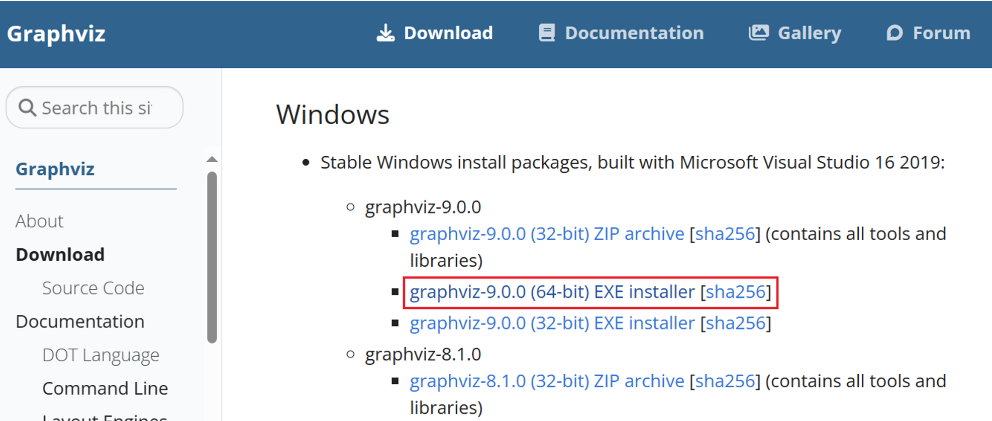

# 安裝 graphviz

# 執行程式報錯

- 報錯
    
    
    
    - 找不到相關路徑
        
        
        

# 原因

[graphviz pip安装成功后，调用时报错的解决办法](https://zhuanlan.zhihu.com/p/35639711)

# 解決方式

- 搜尋 graphviz ⇒ 下載 ⇒ 安裝 ⇒ **點選添加環境變數**
    
    [Download | Graphviz](https://graphviz.org/download/)
    
    
    
    - 如果在安裝時，沒點選到，可自行將路徑添加到環境變數中即可
        
        
        
    
    - 自行添加路經到環境變數中
        
        
    
- 成功執行
    